<div align="center">

<br />

<h1>
  <br />
  Resume Intake
</h1>

<p>
  <strong>Collect. Render. Deliver.</strong><br />
  A modern candidate intake platform with first-class <a href="https://open.feishu.cn">Feishu</a> integration.<br />
  <sub>Polished form → signed PDF → Feishu group chat + Bitable, in one flow.</sub>
</p>

<p>
  
  
  
  
  
</p>

<p>
  <a href="#-highlights">Highlights</a> ·
  <a href="#-architecture">Architecture</a> ·
  <a href="#-quick-start">Quick Start</a> ·
  <a href="#-environment">Environment</a> ·
  <a href="#-deployment">Deployment</a>
</p>

<br />

</div>

---

## 📸 Preview

<div align="center">

<!-- Replace with a real screenshot / demo GIF -->


<sub><i>Drop a screenshot or demo GIF here.</i></sub>

</div>

---

## ✨ Highlights

<table>
  <tr>
    <td width="33%" valign="top">
      <h3>🎨 Polished UX</h3>
      <p>Built on <code>shadcn/ui</code> + <code>react-hook-form</code> + <code>zod</code>. Signature canvas, inline validation, dark mode out of the box.</p>
    </td>
    <td width="33%" valign="top">
      <h3>📄 Real PDFs</h3>
      <p>Server-side rendering via <code>pdf-lib</code> with embedded <b>Noto Sans SC</b>. Full Chinese glyph coverage — no subset artifacts, no preview glitches.</p>
    </td>
    <td width="33%" valign="top">
      <h3>🔔 Feishu Group Chat</h3>
      <p>On submit, your group receives a rich <b>interactive card</b> with candidate name, role, and a one-click link straight to the record.</p>
    </td>
  </tr>
  <tr>
    <td width="33%" valign="top">
      <h3>📊 Feishu Bitable</h3>
      <p>Every submission becomes a row. The generated PDF is attached to that row via <code>parent_type=bitable_file</code>. <b>No DB. No S3.</b></p>
    </td>
    <td width="33%" valign="top">
      <h3>🔐 Zero-cost Storage</h3>
      <p>PDFs live in Feishu Drive, bound to the Bitable row. Free, scalable, access-controlled by your tenant.</p>
    </td>
    <td width="33%" valign="top">
      <h3>🌍 Deploy Anywhere</h3>
      <p>Ships as a standard Next.js app. Runs on Vercel, EdgeOne, Cloudflare, or any Node host.</p>
    </td>
  </tr>
</table>

---

## 🏗 Architecture

```mermaid
flowchart LR
    A[👤 Candidate<br/>Browser] -->|POST /api/resume| B[🌐 Next.js<br/>App Router]
    B --> C[📄 pdf-lib<br/>+ Noto Sans SC]
    C -->|Buffer| D[🔑 Feishu Auth<br/>tenant_access_token<br/><i>cached 2h</i>]
    D --> E[☁️ Feishu Drive<br/>upload_all<br/><code>parent_type=bitable_file</code>]
    E -->|file_token| F[(📊 Feishu Bitable<br/>Records API)]
    F --> G[🔔 Group Webhook<br/>Interactive Card]

    style A fill:#e1f5ff,stroke:#0284c7,color:#000
    style B fill:#f3e8ff,stroke:#7c3aed,color:#000
    style C fill:#fef3c7,stroke:#d97706,color:#000
    style D fill:#fee2e2,stroke:#dc2626,color:#000
    style E fill:#dcfce7,stroke:#16a34a,color:#000
    style F fill:#dbeafe,stroke:#2563eb,color:#000
    style G fill:#fae8ff,stroke:#a21caf,color:#000
```



<details>
<summary>🔍 <b>Data flow in words</b></summary>

1. Candidate fills the form; client-side `zod` validates.
2. Form POSTs JSON to `/api/resume`.
3. Server renders a PDF with `pdf-lib`, embedding full Noto Sans SC (no subset).
4. `tenant_access_token` is fetched (or returned from a 2-hour in-process cache).
5. The PDF is uploaded to Feishu Drive with `parent_type=bitable_file` and the target Bitable's `app_token` as `parent_node` — this binds the file to the Bitable's attachment pool.
6. A Bitable record is created with core fields and the attachment references the uploaded `file_token`.
7. A webhook POST delivers an interactive card to the Feishu group, with a deep link to the new row.

</details>

---

## 🛠 Tech Stack

<table>
  <tr>
    <td align="center" width="25%"><b>Framework</b></td>
    <td width="75%">Next.js 16 · React 19 · App Router · Turbopack</td>
  </tr>
  <tr>
    <td align="center"><b>UI</b></td>
    <td>shadcn/ui · Radix Primitives · Tailwind CSS v4 · Lucide Icons</td>
  </tr>
  <tr>
    <td align="center"><b>Forms</b></td>
    <td>react-hook-form · zod · @hookform/resolvers</td>
  </tr>
  <tr>
    <td align="center"><b>PDF</b></td>
    <td>pdf-lib · @pdf-lib/fontkit · Noto Sans SC (embedded)</td>
  </tr>
  <tr>
    <td align="center"><b>Integration</b></td>
    <td>Feishu Open Platform · Bitable API · Drive API · Webhook Bot</td>
  </tr>
  <tr>
    <td align="center"><b>Runtime</b></td>
    <td>Node 20+ · pnpm 9 (enforced)</td>
  </tr>
</table>

---

## 🚀 Quick Start

```bash
# 1. Clone
git clone <your-fork> resume-intake && cd resume-intake

# 2. Install (pnpm required)
pnpm install

# 3. Configure
cp .env.example .env.local
# edit .env.local — see Environment below

# 4. Run
pnpm dev
```

Open [http://localhost:5000](http://localhost:5000).

<details>
<summary><b>Production build</b></summary>

```bash
pnpm build
pnpm start
```

</details>

---

## 🔐 Environment

```env
# Feishu self-built app
FEISHU_APP_ID=cli_xxxxxxxxxxxxxxxx
FEISHU_APP_SECRET=xxxxxxxxxxxxxxxxxxxxxxxxxxxxxxxx

# Target Bitable
FEISHU_BITABLE_TOKEN=xxxxxxxxxxxxxxxxxxxx   # app_token of the Bitable
FEISHU_TABLE_ID=tblxxxxxxxxxxxxx            # table id inside the Bitable

# Group webhook (optional)
FEISHU_WEBHOOK_URL=https://open.feishu.cn/open-apis/bot/v2/hook/xxxxxxxx
```

<details>
<summary><b>📋 Required Bitable schema</b></summary>

Field names must match **exactly**:

| Field     | Type         |
| --------- | ------------ |
| `姓名`    | Text         |
| `手机`    | Text         |
| `应聘岗位`| Text         |
| `提交时间`| Date/Time    |
| `简历附件`| Attachment   |

</details>

<details>
<summary><b>🔑 Required Feishu app scopes</b></summary>

- `bitable:app` — read/write records
- `drive:drive` (or `drive:file`) — upload attachments

After adding scopes, **publish a new version** of the app, then invite it to your Bitable (`⋯` → More → Add document app → **Manage**).

</details>

---

## 📁 Project Layout

```
src/
├── app/
│   ├── api/resume/route.ts      ← submission endpoint
│   ├── layout.tsx
│   └── page.tsx                 ← intake form
├── components/
│   ├── resume/                  ← form sections, signature canvas
│   └── ui/                      ← shadcn primitives
├── lib/
│   ├── feishu-bitable.ts        ← token cache + upload + record
│   ├── resume-pdf-template.ts   ← PDF generator + webhook
│   └── utils.ts
└── types/resume.ts

public/
├── fonts/NotoSansSC-Regular.ttf ← embedded CN font
└── logo.png
```

---

## 🌐 Deployment

<table>
  <thead>
    <tr>
      <th>Platform</th>
      <th>Status</th>
      <th>Notes</th>
    </tr>
  </thead>
  <tbody>
    <tr>
      <td><b>Vercel</b></td>
      <td>✅ Works</td>
      <td>Default runtime. Add env vars, deploy.</td>
    </tr>
    <tr>
      <td><b>Tencent EdgeOne Pages</b></td>
      <td>✅ Works</td>
      <td>Set install command to <code>pnpm install</code> (override default <code>npm install</code>).</td>
    </tr>
    <tr>
      <td><b>Cloudflare Pages</b></td>
      <td>⚙️ Needs adapter</td>
      <td>Requires <code>@cloudflare/next-on-pages</code>; Edge runtime.</td>
    </tr>
    <tr>
      <td><b>Self-hosted</b></td>
      <td>✅ Works</td>
      <td><code>pnpm build && pnpm start</code> behind Nginx / Caddy.</td>
    </tr>
  </tbody>
</table>

---

## 📜 License

[MIT](./LICENSE)

---

<div align="center">

<sub>Built with ❤️ and <a href="https://claude.com/claude-code"><b>Claude Code</b></a>.</sub><br />
<sub>Powered by <a href="https://nextjs.org">Next.js</a> · <a href="https://open.feishu.cn">Feishu Open Platform</a>.</sub>

</div>
